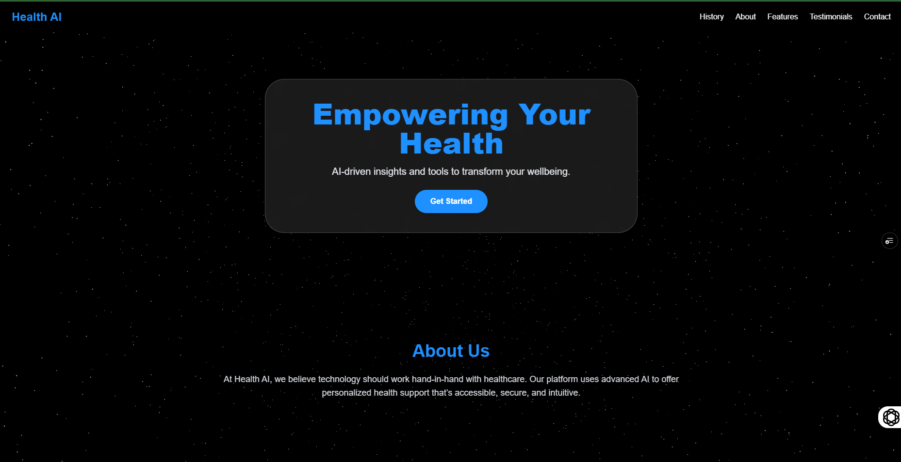

# Health AI

**Health AI** is a full-stack web application that leverages **Machine Learning**, **OCR**, and **Natural Language Processing (NLP)** to provide real-time health condition predictions and personalized precautionary suggestions based on user symptoms.

Users can input symptoms as **plain text** or **upload a PDF**, and the system processes the input using an AI microservice to return predictions with over **91% accuracy**.

---
### Home Page

## 🚀 Live Demo

🔗 [Click here to try Health AI](https://health-ai-6f9n.vercel.app/)

---

## ✨ Features

- ✅ Symptom extraction from plain text and PDF files
- ✅ AI-based disease prediction using multi-label classification
- ✅ Personalized precautionary health recommendations
- ✅ OCR integration for PDF input using Tesseract
- ✅ Real-time AI inference using Flask microservice
- ✅ Scalable microservice-based architecture

---

## 🛠️ Tech Stack

### 🖥️ Frontend
- [React.js](https://reactjs.org/) (with [Vite](https://vitejs.dev/)) — blazing fast and modern SPA
- [TailwindCSS](https://tailwindcss.com/) — utility-first CSS for responsive design

### 🔙 Backend
- [Node.js](https://nodejs.org/) + [Express](https://expressjs.com/) — handles authentication, user routes, and messaging
- [MongoDB](https://www.mongodb.com/) — stores users and messages

### 🤖 Machine Learning
- Multi-label classification model trained on symptom-disease datasets
- Built with [Hugging Face Transformers](https://huggingface.co/)
- [Tesseract OCR](https://github.com/tesseract-ocr/tesseract) for PDF text extraction
- [Flask](https://flask.palletsprojects.com/) API to serve the model as a microservice

---
## 🧾 How to Use
- Open the live app or run it locally.

- Sign up or log in.

- Enter your symptoms as text or upload a PDF file.

- Receive predicted health conditions and precautionary steps.

## 📁 Folder Structure
<pre>  
health-ai/
│ ├── client/ # React frontend
  │ ├── public/ 
  │ └── src/ 
  │ ├── components/ 
  │ ├── pages/
  │ └── utils/
  │ ├── server/ # Node.js backend (Auth + Messaging)
  │ ├── controllers/ 
  │ ├── routes/ 
  │ ├── models/ 
  │ └── middleware/
  │ ├── modelapi/ # Flask microservice for ML model
  │ ├── model_server.py
  │ └── model/ # Pretrained model files 
  │ ├── assets/ # (Optional) Screenshots or static assets 
  │ ├── README.md
  └── package.json 
</pre>
